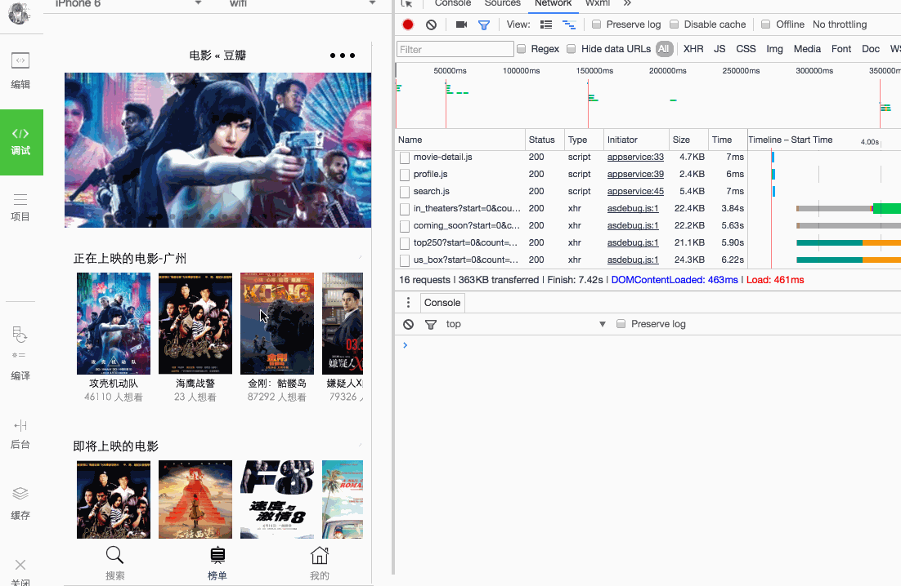

# douban movie mini program
一个微信小程序开发豆瓣电影demo

## Getting Started
###  Installation
```
# 克隆仓库到指定的文件夹
$ git clone git@github.com:xifengzhu/douban-movie-mini-program.git

# cd douban-movie-mini-program
```
### Develop

打开微信Web开放者工具，将下载的项目添加进去，填写或选择相应信息

## Preview


## Used wechat api and Components
### Api
* wx.request(发起网络请求)
* Page.onShareAppMessage（设置该页面的分享信息）
* wx.login(调用接口登录获取用户信息)
* Page.onPullDownRefresh（监听该页面用户下拉刷新事件）
* Page.onReachBottom(无限滚动加载)
* wx.switchTab (跳转到 tabBar 页面，并关闭其他所有非 tabBar 页面)
* wx.navigateTo (保留当前页面，跳转到应用内的某个页面)

### Components
* view
* scroll-view
* swiper
* image
* input

## Plans
* 使用命令生成页面（自动添加一个文件夹跟必须的三个文件）
* 支持sass语法
* 自动生成新页面时，自动添加配置到app.json

## Bugs
* 详情滚动不太流畅（原因未知）
* 列表页面下拉刷新不太好使
